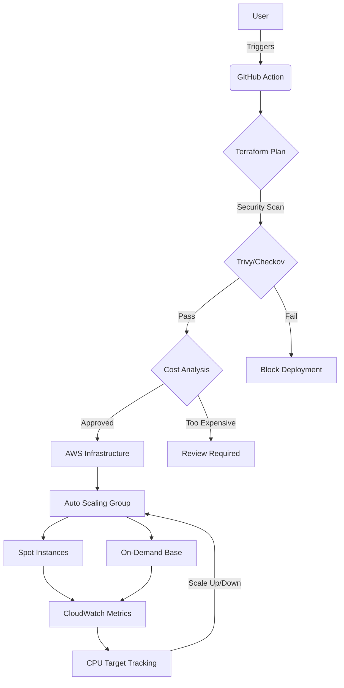

# Ethereal Spot Compute Orchestrator

# Security Compliance Badge
[](https://github.com/MarkChisholm-dev/Ethereal-Spot-Manager/actions/workflows/docs.yml)

[](https://www.ttpn.org/)

# Stack
[](https://www.terraform.io/)
[](https://aws.amazon.com/)
[](https://github.com/features/actions)
[](https://github.com/aquasecurity/trivy)
[](https://www.infracost.io/)

## Overview
The **Ethereal Spot Compute Orchestrator** is a production-grade Terraform module engineered for High-Performance Computing (HPC) environments. It automates the provisioning of GPU-accelerated clusters by utilizing AWS Mixed Instances Policy, balancing mission-critical reliability with aggressive cost-optimization.

Developed as a core component of the **Ethereal Cloud Systems** infrastructure suite, this module features enterprise-level security, intelligent auto-scaling, comprehensive health monitoring, and automated testing capabilities.



## Key Features

### 🔒 Security & Compliance
* **Hardened IMDSv2:** Mandatory session tokens preventing SSRF attacks (AVD-AWS-0130 compliant)
* **Encrypted Data at Rest:** AES-256 encryption with customer-managed KMS keys (TPN/ISO 27001)
* **Zero-Trust Networking:** Private subnet deployment with no public IP exposure
* **Security Validation:** KMS key ARN validation with automatic compliance checks
* **Metadata Hardening:** Instance metadata tags enabled, IPv6 disabled by default

### 📈 Auto Scaling & Performance
* **CPU-Based Auto Scaling:** Target tracking policies with configurable thresholds
* **Health Monitoring:** Configurable EC2/ELB health checks with grace periods
* **Capacity Rebalancing:** Proactive Spot instance replacement before interruption
* **Smart Termination:** Oldest launch template first for gradual updates
* **Instance Refresh:** Rolling updates maintaining 50% minimum healthy capacity
* **Lifecycle Management:** Automatic instance rotation (configurable, default 1 week)

### 💰 Cost Optimization
* **Spot-Optimized Strategy:** Capacity-optimized allocation for maximum availability
* **Mixed Instance Policy:** Guaranteed On-Demand base with Spot overflow
* **gp3 Performance Tuning:** Customizable IOPS (3000-16000) and throughput (125-1000 MiB/s)
* **CloudWatch Metrics:** Granular monitoring for cost-effective scaling decisions
* **Infracost Integration:** Automated cost estimation in CI/CD pipeline

### 🔔 Operational Excellence
* **SNS Notifications:** Optional alerts for launch/terminate events and errors
* **Comprehensive Tagging:** Environment, CostCenter, Project tags for attribution
* **Enhanced Outputs:** Complete resource details for monitoring and debugging
* **Configurable Devices:** Flexible root device naming for various AMI types
* **Detailed Metrics:** ASG metrics collection for observability

## CI/CD Pipeline Architecture
This repository utilizes GitHub Actions to enforce a "Shift-Left" methodology:
1.  **Validation:** Syntactic and formatting checks via `terraform fmt` and `validate`
2.  **Security:** Static Analysis Security Testing (SAST) via **Trivy** to prevent configuration drift
3.  **Cost Governance:** Automated spend forecasting via **Infracost**
4.  **Compliance:** Automated security policy enforcement

## Testing

### Quick Test (No AWS Credentials Needed)
```bash
# Run automated test suite
./test.sh
```

This validates:
- ✅ Code formatting
- ✅ Configuration syntax
- ✅ Variable validation rules
- ✅ Resource structure
- 🔒 Security scanning (if tools available)

### Manual Testing
```bash
# Initialize and validate
terraform init
terraform validate

# Preview changes with test values
terraform plan -var-file=terraform.tfvars.example

# Check formatting
terraform fmt -check -recursive
```

### Advanced Testing
See [TESTING.md](TESTING.md) for comprehensive testing guide including:
- Security scanning with Checkov/Trivy
- Cost estimation with Infracost
- Linting with tflint
- CI/CD integration examples

## Configuration

### Required Variables
| Variable | Description | Example |
|----------|-------------|---------|
| `ami_id` | Hardened AMI ID with GPU drivers | `ami-0c55b159cbfafe1f0` |
| `kms_key_arn` | KMS key for EBS encryption (**required**) | `arn:aws:kms:...` |
| `subnet_ids` | List of private subnet IDs | `["subnet-abc", "subnet-def"]` |
| `security_group_id` | Security group ID for instances | `sg-0123456789abcdef0` |

### Optional Configuration
| Variable | Description | Default |
|----------|-------------|---------|
| `instance_type` | Primary GPU instance type | `g4dn.xlarge` |
| `fallback_instance_type` | Fallback GPU instance type | `g5.xlarge` |
| `on_demand_base` | Guaranteed On-Demand instances | `2` |
| `desired_capacity` | Target instance count | `10` |
| `min_size` | Minimum instances | `2` |
| `max_size` | Maximum instances | `50` |
| `disk_size` | Root volume size (GB) | `100` |
| `ebs_iops` | gp3 IOPS (3000-16000) | `3000` |
| `ebs_throughput` | gp3 throughput MiB/s (125-1000) | `125` |
| `enable_cpu_scaling` | Enable auto scaling | `true` |
| `target_cpu_utilization` | Target CPU % for scaling | `70` |
| `max_instance_lifetime` | Max instance age (seconds) | `604800` (1 week) |
| `health_check_type` | Health check type (EC2/ELB) | `EC2` |
| `health_check_grace_period` | Grace period (seconds) | `300` |
| `environment` | Environment tag | `production` |
| `cost_center` | Cost center tag | `HPC-Engineering` |
| `project` | Project tag | `Ethereal-Cloud-Systems` |
| `sns_topic_arn` | SNS topic for notifications | `null` (disabled) |
| `root_device_name` | Root device name | `/dev/xvda` |
| `bootstrap_script` | User data script | Basic cloud-utils install |

See [terraform.tfvars.example](terraform.tfvars.example) for a complete example configuration.


## Deployment Example

### Basic Deployment
```hcl
module "hpc_cluster_production" {
  source = "git::https://github.com/MarkChisholm-dev/ethereal-spot-manager.git?ref=v1.2.0"
  
  # Required: Instance configuration
  ami_id            = "ami-0123456789abcdef0"
  security_group_id = "sg-0123456789abcdef0"
  subnet_ids        = ["subnet-0a1b2c3d", "subnet-4e5f6g7h"]
  
  # Required: Security (KMS key is required for compliance)
  kms_key_arn = "arn:aws:kms:eu-west-1:123456789012:key/12345678-1234-1234-1234-123456789012"
}
```

### Production Deployment (Full Configuration)
```hcl
module "hpc_cluster_production" {
  source = "git::https://github.com/MarkChisholm-dev/ethereal-spot-manager.git?ref=v1.2.0"
  
  # Instance configuration
  ami_id                   = "ami-0123456789abcdef0"
  instance_type            = "g4dn.xlarge"
  fallback_instance_type   = "g5.xlarge"
  
  # Capacity configuration
  on_demand_base           = 5
  desired_capacity         = 50
  min_size                 = 5
  max_size                 = 100
  
  # Security configuration (KMS key is required)
  kms_key_arn              = "arn:aws:kms:eu-west-1:123456789012:key/12345678-1234-1234-1234-123456789012"
  subnet_ids               = ["subnet-0a1b2c3d", "subnet-4e5f6g7h"]
  security_group_id        = "sg-0123456789abcdef0"
  
  # Performance tuning
  disk_size                = 200
  ebs_iops                 = 5000
  ebs_throughput           = 250
  
  # Auto scaling
  enable_cpu_scaling       = true
  target_cpu_utilization   = 70
  
  # Health checks
  health_check_type         = "ELB"  # Use ELB if behind load balancer
  health_check_grace_period = 600    # 10 minutes for slow boot times
  
  # Lifecycle
  max_instance_lifetime     = 604800  # 1 week - forces refresh
  
  # Tagging for cost attribution
  environment              = "production"
  cost_center              = "Research-ML"
  project                  = "Ethereal-Cloud-Systems"
  
  # Notifications
  sns_topic_arn            = "arn:aws:sns:eu-west-1:123456789012:fleet-notifications"
  
  # Custom bootstrap
  bootstrap_script = <<-EOF
    #!/bin/bash
    # Install NVIDIA drivers
    aws s3 cp s3://my-bucket/install-gpu-drivers.sh /tmp/
    bash /tmp/install-gpu-drivers.sh
    
    # Join compute cluster
    echo "MASTER_NODE=10.0.1.50" >> /etc/environment
    systemctl start worker-agent
  EOF
}
```

## Outputs

The module provides comprehensive outputs for integration with monitoring and other infrastructure:

```hcl
# Auto Scaling Group details
output "asg_name" {
  description = "Name of the Auto Scaling Group"
}

output "fleet_id" {
  description = "ID of the compute fleet"
}

# Launch Template details
output "launch_template_id" {
  description = "ID of the launch template"
}

output "launch_template_arn" {
  description = "ARN of the launch template"
}

output "launch_template_latest_version" {
  description = "Latest version number"
}

# Network and security
output "security_group_id" {
  description = "Security group ID"
}

output "subnet_ids" {
  description = "Subnet IDs where instances are deployed"
}

# Scaling configuration
output "cpu_scaling_policy_arn" {
  description = "ARN of CPU-based auto scaling policy"
}

output "capacity_config" {
  description = "Current capacity configuration (min/max/desired)"
}
```

### Using Outputs
```hcl
# Reference outputs in other resources
resource "aws_cloudwatch_dashboard" "fleet_metrics" {
  dashboard_name = "hpc-fleet-${module.hpc_cluster_production.fleet_id}"
  
  # Use fleet_id in dashboard configuration
}

# Output for external use
output "cluster_asg_name" {
  value = module.hpc_cluster_production.asg_name
}
```

## Quick Start

### Local Testing (No Deployment)

1. **Clone and test locally:**
```bash
git clone https://github.com/MarkChisholm-dev/ethereal-spot-manager.git
cd ethereal-spot-manager

# Run tests (no AWS credentials needed)
./test.sh
```

2. **Configure and validate:**
```bash
# Copy example variables
cp terraform.tfvars.example terraform.tfvars

# Edit with your test values
vi terraform.tfvars

# Validate the configuration
terraform validate
```

### Automated Deployment via GitHub Actions

To enable automatic deployment on push to `main`:

1. **Set GitHub Secrets** in your repository (Settings → Secrets and variables → Actions):

   **AWS Authentication:**
   - `AWS_ACCESS_KEY_ID` - Your AWS access key
   - `AWS_SECRET_ACCESS_KEY` - Your AWS secret key
   - `AWS_REGION` - (optional, defaults to `us-east-1`)

   **Infrastructure Variables:**
   - `TF_VAR_AMI_ID` - EC2 AMI ID for compute instances
   - `TF_VAR_KMS_KEY_ARN` - KMS key ARN for encryption
   - `TF_VAR_SUBNET_IDS` - JSON array of subnet IDs
   - `TF_VAR_SECURITY_GROUP_ID` - Security group ID

2. **Trigger deployment** (automatically on push or manual via Actions tab)

For detailed setup instructions, see [TESTING.md](TESTING.md#cidcd-github-actions-setup).

### Local Deployment (Terraform CLI)

```bash
terraform init
terraform plan
terraform apply
```

## Architecture Decisions

### Why Spot + On-Demand Mix?
- **Resilience:** On-Demand base ensures minimum capacity during Spot unavailability
- **Cost:** Spot instances provide up to 90% savings over On-Demand pricing
- **Availability:** Capacity-optimized allocation selects pools with lowest interruption risk

### Why gp3 Over gp2?
- **Performance:** Independent IOPS and throughput scaling
- **Cost:** 20% cheaper than gp2 for same baseline performance
- **Flexibility:** Can increase IOPS without changing volume size

### Why CPU-Based Auto Scaling?
- **Simplicity:** Works out-of-the-box without ELB
- **Predictable:** Direct correlation between CPU and compute capacity needs
- **Extensible:** Easy to add custom metrics later

### Why IMDSv2 Mandatory?
- **Security:** Prevents SSRF attacks on metadata endpoint
- **Compliance:** Required for many security frameworks (TPN, SOC2, ISO 27001)
- **Best Practice:** AWS recommendation for all production workloads

## File Structure

```
.
├── main.tf                      # Core infrastructure resources
├── variables.tf                 # Input variable definitions
├── outputs.tf                   # Output definitions
├── versions.tf                  # Terraform and provider versions
├── terraform.tfvars.example     # Example configuration
├── test.sh                      # Automated test script
├── TESTING.md                   # Comprehensive testing guide
├── .gitignore                   # Git ignore patterns
└── README.md                    # This file
```

## Security Best Practices

1. **KMS Key Management:**
   - Use customer-managed KMS keys (required by this module)
   - Rotate keys annually
   - Use separate keys per environment

2. **Network Isolation:**
   - Deploy only in private subnets
   - Use VPC endpoints for AWS service access
   - Implement strict security group rules

3. **Instance Hardening:**
   - Use hardened AMIs with security patches
   - Disable unnecessary services in bootstrap script
   - Enable AWS Systems Manager for patch management

4. **Monitoring:**
   - Enable CloudWatch detailed monitoring
   - Configure SNS alerts for scaling events
   - Monitor Spot interruption notices

## Troubleshooting

### Validation Error: "KMS key ARN is required"
**Solution:** The module enforces KMS encryption for compliance. Provide a valid KMS key ARN:
```hcl
kms_key_arn = "arn:aws:kms:region:account-id:key/key-id"
```

### Plan Fails: "Invalid IOPS value"
**Solution:** gp3 IOPS must be between 3000-16000:
```hcl
ebs_iops = 5000  # Valid range: 3000-16000
```

### Instances Not Scaling
**Solution:** Check if CPU-based scaling is enabled and CloudWatch metrics are publishing:
```bash
aws autoscaling describe-policies --auto-scaling-group-name ethereal-compute-fleet
aws cloudwatch get-metric-statistics --namespace AWS/EC2 --metric-name CPUUtilization
```

### Spot Interruptions Too Frequent
**Solution:** Increase On-Demand base capacity:
```hcl
on_demand_base = 10  # Increase from default of 2
```

## Contributing

Contributions are welcome! Please ensure:
- All tests pass: `./test.sh`
- Code is formatted: `terraform fmt -recursive`
- Security scans pass: `checkov -d .`
- Documentation is updated

## License

See [LICENSE](LICENSE) for details.

## Support

For issues and questions:
- 🐛 **Bug Reports:** [GitHub Issues](https://github.com/MarkChisholm-dev/ethereal-spot-manager/issues)
- 💬 **Discussions:** [GitHub Discussions](https://github.com/MarkChisholm-dev/ethereal-spot-manager/discussions)
- 📧 **Security:** Report security issues privately

## Changelog

### v1.2.0 (Latest)
- ✅ Added comprehensive auto-scaling policies
- ✅ Implemented health check configuration
- ✅ Added capacity rebalancing for Spot instances
- ✅ Enhanced security with IMDSv2 hardening
- ✅ Added gp3 IOPS and throughput configuration
- ✅ Implemented SNS notifications for scale events
- ✅ Added comprehensive tagging for cost attribution
- ✅ Created automated testing framework
- ✅ Added validation for all critical variables
- ✅ Improved documentation with testing guide
- ✅ Added max instance lifetime for automatic refresh
- ✅ Enhanced outputs for monitoring integration

---

**Built with ❤️ for High-Performance Computing**


