# ✨ Ethereal Spot Compute Orchestrator

<div align="center">

**Supercharge your HPC infrastructure with intelligent GPU cluster orchestration**

[](https://github.com/MarkChisholm-dev/Ethereal-Spot-Manager/actions/workflows/docs.yml)
[](https://github.com/MarkChisholm-dev/Ethereal-Spot-Manager/actions/workflows/security.yml)
[](https://github.com/MarkChisholm-dev/Ethereal-Spot-Manager/actions/workflows/deploy.yml)
[](https://github.com/MarkChisholm-dev/Ethereal-Spot-Manager/actions/workflows/test.yml)
[](https://github.com/MarkChisholm-dev/Ethereal-Spot-Manager/actions/workflows/validate.yml)
[](https://www.ttpn.org/)
[](https://www.terraform.io/)
[](https://aws.amazon.com/)
[](https://github.com/features/actions)
[](https://github.com/aquasecurity/trivy)
[](https://www.infracost.io/)

</div>

---

## 🚀 Overview

The **Ethereal Spot Compute Orchestrator** is a **production-grade Terraform module** engineered for High-Performance Computing (HPC) environments. It automates the provisioning of **GPU-accelerated clusters** with surgical precision, leveraging AWS Mixed Instances Policy to balance mission-critical reliability with aggressive cost-optimization.

**Part of the Ethereal Cloud Systems infrastructure suite**, this module delivers:
- 🔒 **Enterprise-grade security** with TPN compliance
- ⚡ **Intelligent auto-scaling** optimized for GPU workloads  
- 📊 **Comprehensive health monitoring** with dark matter visibility
- 🧪 **Automated testing** that stays ahead of problems

## 🏗️ Architecture Overview

The Ethereal orchestration pipeline ensures every deployment is **secure, audited, and cost-optimized**:

```mermaid
graph TD
    A[User] -->|Triggers| B(GitHub Action)
    B --> C{Terraform Plan}
    C -->|Security Scan| D{Trivy/Checkov}
    D -->|Pass| E{Cost Analysis}
    E -->|Approved| F["🚀 AWS Infrastructure"]
    E -->|Too Expensive| G["⚠️ Review Required"]
    D -->|Fail| H["🚫 Block Deployment"]
    F --> I["Auto Scaling Group"]
    I --> J["💰 Spot Instances<br/>90% Savings"]
    I --> K["🛡️ On-Demand Base<br/>Guaranteed Capacity"]
    J --> L["📊 CloudWatch Metrics"]
    K --> L
    L --> M["🎯 CPU Target Tracking"]
    M -->|Scale Up/Down| I
```



---

## ✨ Key Features

### 🔒 Security & Compliance
- **Hardened IMDSv2:** Mandatory session tokens blocking SSRF attacks *(AVD-AWS-0130 compliant)*
- **AES-256 Encryption:** All data at rest secured with customer-managed KMS keys *(TPN/ISO 27001)*
- **Zero-Trust Networking:** Private subnet deployment, zero public IP exposure
- **Smart Validation:** KMS key ARN validation with automatic compliance enforcement
- **Metadata Hardening:** Instance metadata tags enabled, IPv6 disabled by default

### 📈 Auto Scaling & Performance  
- **CPU-Based Scaling:** Target tracking policies with configurable thresholds
- **Health Monitoring:** Configurable EC2/ELB health checks with grace periods
- **Capacity Rebalancing:** Proactive Spot replacement before interruption signals
- **Smart Termination:** Oldest launch template first for graceful rolling updates
- **Instance Refresh:** Rolling updates maintaining 50% minimum healthy capacity
- **Lifecycle Management:** Automatic instance rotation *(configurable, default 1 week)*

### 💰 Cost Optimization
- **Spot-Optimized Strategy:** Capacity-optimized allocation maximizing availability at lowest cost
- **Mixed Instance Policy:** Guaranteed On-Demand base with Spot overflow for flexibility
- **gp3 Performance Tuning:** Customize IOPS (3000-16000) and throughput (125-1000 MiB/s)
- **CloudWatch Insights:** Granular monitoring for data-driven scaling decisions
- **Infracost Integration:** Automated cost estimation in your CI/CD pipeline

### 🔔 Operational Excellence
- **SNS Notifications:** Real-time alerts for launch/terminate events and errors
- **Comprehensive Tagging:** Environment, CostCenter, Project tags for cost attribution
- **Enhanced Outputs:** Complete resource details for monitoring and debugging
- **Flexible Configuration:** Adaptable to various AMI types and deployment scenarios
- **Deep Observability:** ASG metrics collection for complete visibility

---

## 🔄 CI/CD Pipeline: Shift-Left Security™

This repository implements a "Shift-Left" security model—catching issues **before they reach production**:

| Phase | Tool | Purpose |
|-------|------|---------|
| 1️⃣ **Validation** | `terraform fmt` + `validate` | Syntactic correctness & formatting |
| 2️⃣ **Security** | **Trivy** SAST | Configuration drift prevention |
| 3️⃣ **Cost Governance** | **Infracost** | Automated spend forecasting |
| 4️⃣ **Compliance** | Security policies | Automated enforcement |

---

## 🧪 Testing

### ⚡ Quick Test (No AWS Credentials Needed)
```bash
./test.sh
```

**Validates:**
- ✅ Code formatting
- ✅ Configuration syntax
- ✅ Variable validation rules  
- ✅ Resource structure integrity
- 🔒 Security scanning *(if tools available)*

### 🧪 Manual Testing
```bash
terraform init
terraform validate

# Preview with test values
terraform plan -var-file=terraform.tfvars.example

# Check formatting
terraform fmt -check -recursive
```

### 📚 Advanced Testing
See [TESTING.md](TESTING.md) for **comprehensive testing guide** including:
- 🔐 Security scanning (Checkov/Trivy)
- 💵 Cost estimation (Infracost)
- 🔍 Linting (tflint)
- 🤖 CI/CD integration examples

---

## ⚙️ Configuration

### 📋 Required Variables

| Variable | Description | Example |
|----------|-------------|---------|
| `ami_id` | Hardened AMI ID with GPU drivers | `ami-0c55b159cbfafe1f0` |
| `kms_key_arn` | **KMS key for EBS encryption** | `arn:aws:kms:...` |
| `subnet_ids` | Private subnet IDs for deployment | `["subnet-abc", "subnet-def"]` |
| `security_group_id` | Security group for instance access | `sg-0123456789abcdef0` |

### 🎛️ Optional Configuration

| Variable | Description | Default |
|----------|-------------|---------|
| `instance_type` | Primary GPU instance type | `g4dn.xlarge` |
| `fallback_instance_type` | Fallback GPU instance type | `g5.xlarge` |
| `on_demand_base` | Guaranteed On-Demand instances | `2` |
| `desired_capacity` | Target instance count | `10` |
| `min_size` / `max_size` | Scaling bounds | `2` / `50` |
| `disk_size` | Root volume size (GB) | `100` |
| `ebs_iops` | gp3 IOPS (3000-16000) | `3000` |
| `ebs_throughput` | gp3 throughput MiB/s (125-1000) | `125` |
| `enable_cpu_scaling` | Enable auto scaling | `true` |
| `target_cpu_utilization` | CPU % target for scaling | `70` |
| `max_instance_lifetime` | Max instance age (seconds) | `604800` *(1 week)* |
| `health_check_type` | Health check source | `EC2` |
| `health_check_grace_period` | Grace period (seconds) | `300` |
| `environment` | Environment tag | `production` |
| `cost_center` | Cost center tag | `HPC-Engineering` |
| `project` | Project tag | `Ethereal-Cloud-Systems` |
| `sns_topic_arn` | SNS topic for notifications | `null` *(disabled)* |
| `root_device_name` | Root device name | `/dev/xvda` |
| `bootstrap_script` | User data initialization script | Cloud-utils install |

📖 See [terraform.tfvars.example](terraform.tfvars.example) for complete example configuration.


---

## 🚀 Deployment Examples

### 📦 Minimal Deployment
```hcl
module "hpc_cluster" {
  source = "git::https://github.com/MarkChisholm-dev/ethereal-spot-manager.git?ref=v1.2.0"
  
  # Required parameters
  ami_id            = "ami-0123456789abcdef0"
  security_group_id = "sg-0123456789abcdef0"
  subnet_ids        = ["subnet-0a1b2c3d", "subnet-4e5f6g7h"]
  kms_key_arn       = "arn:aws:kms:eu-west-1:123456789012:key/12345678-1234-1234-1234-123456789012"
}
```

### 🏢 Production Deployment (Full Configuration)
```hcl
module "hpc_cluster_production" {
  source = "git::https://github.com/MarkChisholm-dev/ethereal-spot-manager.git?ref=v1.2.0"
  
  # 🖥️ Instance Configuration
  ami_id                   = "ami-0123456789abcdef0"
  instance_type            = "g4dn.xlarge"
  fallback_instance_type   = "g5.xlarge"
  
  # 📊 Capacity Configuration
  on_demand_base           = 5        # Guaranteed resilient base
  desired_capacity         = 50       # Target for normal operation
  min_size                 = 5        # Minimum fleet size
  max_size                 = 100      # Maximum fleet size
  
  # 🔐 Security Configuration (KMS key is required)
  kms_key_arn              = "arn:aws:kms:eu-west-1:123456789012:key/12345678-1234-1234-1234-123456789012"
  subnet_ids               = ["subnet-0a1b2c3d", "subnet-4e5f6g7h"]
  security_group_id        = "sg-0123456789abcdef0"
  
  # ⚡ Performance Tuning
  disk_size                = 200      # Increased from default 100GB
  ebs_iops                 = 5000     # 5x default for GPU workloads
  ebs_throughput           = 250      # Enhanced storage throughput
  
  # 🎯 Auto Scaling Configuration
  enable_cpu_scaling       = true
  target_cpu_utilization   = 70       # Scale at 70% CPU
  
  # 🏥 Health Checks
  health_check_type         = "ELB"      # If behind load balancer
  health_check_grace_period = 600        # 10 minutes for slow boots
  
  # 🔄 Lifecycle Management
  max_instance_lifetime     = 604800     # 1 week - forces refresh
  
  # 💳 Cost Attribution
  environment              = "production"
  cost_center              = "Research-ML"
  project                  = "Ethereal-Cloud-Systems"
  
  # 🔔 Notifications
  sns_topic_arn            = "arn:aws:sns:eu-west-1:123456789012:fleet-notifications"
  
  # 🚀 Custom Bootstrap Script
  bootstrap_script = <<-EOF
    #!/bin/bash
    # Install NVIDIA GPU drivers
    aws s3 cp s3://my-bucket/install-gpu-drivers.sh /tmp/
    bash /tmp/install-gpu-drivers.sh
    
    # Join distributed compute cluster
    echo "MASTER_NODE=10.0.1.50" >> /etc/environment
    systemctl start worker-agent
  EOF
}
```

---

## 📤 Module Outputs

The module provides **comprehensive outputs** for integration with monitoring and other infrastructure:

```hcl
# Auto Scaling Group Details
output "asg_name" {
  description = "Name of the Auto Scaling Group"
}

output "fleet_id" {
  description = "Unique identifier of the compute fleet"
}

# Launch Template Details
output "launch_template_id" {
  description = "ID of the launch template"
}

output "launch_template_arn" {
  description = "ARN of the launch template"
}

output "launch_template_latest_version" {
  description = "Latest version number of the launch template"
}

# Network & Security Details
output "security_group_id" {
  description = "Security group ID for fleet access control"
}

output "subnet_ids" {
  description = "Subnet IDs where instances are deployed"
}

# Auto Scaling Configuration
output "cpu_scaling_policy_arn" {
  description = "ARN of CPU-based auto scaling policy"
}

output "capacity_config" {
  description = "Current capacity configuration (min/max/desired)"
}
```

### Using Outputs
```hcl
# Reference outputs in CloudWatch dashboards
resource "aws_cloudwatch_dashboard" "fleet_metrics" {
  dashboard_name = "hpc-fleet-${module.hpc_cluster_production.fleet_id}"
  # Use fleet_id in your dashboard configuration
}

# Export for external systems
output "cluster_asg_name" {
  value       = module.hpc_cluster_production.asg_name
  description = "ASG name for kubectl/monitoring integration"
}
```

---

## 🏃 Quick Start

### 💻 Local Testing (No Deployment)

1. **Clone and run tests locally:**
```bash
git clone https://github.com/MarkChisholm-dev/ethereal-spot-manager.git
cd ethereal-spot-manager

# Run automated tests (no AWS credentials needed!)
./test.sh
```

2. **Validate your configuration:**
```bash
# Copy example variables
cp terraform.tfvars.example terraform.tfvars

# Edit with your test values
vi terraform.tfvars

# Validate syntax and configuration
terraform validate
```

### 🤖 Automated Deployment (GitHub Actions)

To enable **automatic deployment on push to `main`**:

1. **Set GitHub Secrets** in your repository:
   - Settings → Secrets and variables → Actions

   **AWS Credentials:**
   - `AWS_ACCESS_KEY_ID` - Your AWS access key
   - `AWS_SECRET_ACCESS_KEY` - Your AWS secret key  
   - `AWS_REGION` - *(optional, defaults to `us-east-1`)*

   **Infrastructure Variables:**
   - `TF_VAR_AMI_ID` - EC2 AMI ID
   - `TF_VAR_KMS_KEY_ARN` - KMS key ARN
   - `TF_VAR_SUBNET_IDS` - JSON array of subnet IDs
   - `TF_VAR_SECURITY_GROUP_ID` - Security group ID

2. **Trigger deployment:**
   - Automatically on push to `main`
   - Or manually via Actions tab

📖 See [TESTING.md](TESTING.md#cidcd-github-actions-setup) for detailed GitHub Actions setup.

### ⚙️ Local Deployment (Terraform CLI)

```bash
terraform init
terraform plan        # Preview changes
terraform apply       # Create infrastructure
```

---

## 🏛️ Architecture Decisions

### 💰 Why Spot + On-Demand Mix?
- **Resilience:** On-Demand base ensures minimum capacity during Spot unavailability
- **Cost:** Spot instances provide up to 90% savings over On-Demand pricing
- **Availability:** Capacity-optimized allocation selects pools with lowest interruption risk

### 📦 Why gp3 Over gp2?
- **Performance:** Independent IOPS and throughput scaling
- **Cost:** 20% cheaper than gp2 for same baseline performance
- **Flexibility:** Can increase IOPS without changing volume size

### 📈 Why CPU-Based Auto Scaling?
- **Simplicity:** Works out-of-the-box without ELB
- **Predictable:** Direct correlation between CPU and compute capacity needs
- **Extensible:** Easy to add custom metrics later

### 🔐 Why IMDSv2 Mandatory?
- **Security:** Prevents SSRF attacks on metadata endpoint
- **Compliance:** Required for TPN, SOC2, ISO 27001 frameworks
- **Best Practice:** AWS recommendation for all production workloads

---

## 📁 Project Structure

```
.
├── main.tf                      # 🏗️  Core infrastructure resources
├── variables.tf                 # ⚙️  Input variable definitions
├── outputs.tf                   # 📤 Output definitions
├── versions.tf                  # 📦 Terraform and provider versions
├── terraform.tfvars.example     # 📋 Example configuration
├── test.sh                      # 🧪 Automated test script
├── TESTING.md                   # 📚 Comprehensive testing guide
├── .gitignore                   # 🚫 Git ignore patterns
└── README.md                    # 📖 This file
```

---

## 🔐 Security Best Practices

| Area | Practice | Benefit |
|------|----------|---------|
| **🔑 KMS Keys** | Use customer-managed keys (required) | Compliance with TPN/ISO standards |
| **🔄 Key Rotation** | Rotate annually, separate per environment | Reduces exposure window |
| **🌐 Network** | Private subnets only, VPC endpoints | Zero internet exposure |
| **🚨 Access Control** | Strict security group rules | Least-privilege principle |
| **📦 AMIs** | Hardened with security patches | Attack surface minimization |
| **🛡️ Services** | Disable unnecessary services | Reduce vulnerability surface |
| **🔧 Patch Management** | Enable AWS Systems Manager | Automated security updates |
| **📊 Monitoring** | CloudWatch + SNS alerts + Spot notices | Real-time visibility |

---

## 🐛 Troubleshooting

### ❌ "KMS key ARN is required"
**Problem:** Module validation is enforcing encryption compliance.

**Solution:** Provide a valid KMS key ARN:
```hcl
kms_key_arn = "arn:aws:kms:region:account-id:key/key-id"
```

### ❌ "Invalid IOPS value"
**Problem:** gp3 IOPS must fall within AWS constraints.

**Solution:** Use IOPS between 3000-16000:
```hcl
ebs_iops = 5000  # ✅ Valid range: 3000-16000
```

### ❌ Instances Not Scaling
**Problem:** Fleet not responding to CPU load.

**Solution:** Verify CPU-based scaling and CloudWatch metrics:
```bash
# Check scaling policies
aws autoscaling describe-policies \
  --auto-scaling-group-name ethereal-compute-fleet

# Verify CloudWatch metrics
aws cloudwatch get-metric-statistics \
  --namespace AWS/EC2 \
  --metric-name CPUUtilization
```

### ❌ Spot Interruptions Too Frequent
**Problem:** Spot instances being replaced too often.

**Solution:** Increase On-Demand base capacity:
```hcl
on_demand_base = 10  # Increase from default of 2
```

---

## 🤝 Contributing

Contributions welcome! Before submitting PRs, ensure:

- ✅ Tests pass: `./test.sh`
- ✅ Code formatted: `terraform fmt -recursive`
- ✅ Security checks pass: `checkov -d .`
- ✅ Documentation updated

---

## 📜 License

See [LICENSE](LICENSE) for details.

---

## 💬 Support & Community

**Report issues and ask questions:**

| Channel | Use For |
|---------|----------|
| 🐛 **[GitHub Issues](https://github.com/MarkChisholm-dev/ethereal-spot-manager/issues)** | Bug reports & feature requests |
| 💬 **[GitHub Discussions](https://github.com/MarkChisholm-dev/ethereal-spot-manager/discussions)** | Questions & best practices |
| 📧 **[Security Issues](SECURITY.md)** | Report vulnerabilities privately |

---

## 📝 Changelog

### v2.0 (Latest)
- ✨ Added comprehensive auto-scaling policies
- 🔐 Implemented health check configuration
- ⚡ Added capacity rebalancing for Spot instances
- 🛡️ Enhanced security with IMDSv2 hardening
- 💾 Added gp3 IOPS and throughput configuration
- 🔔 Implemented SNS notifications for scale events
- 💳 Added comprehensive tagging for cost attribution
- 🧪 Created automated testing framework
- ✔️ Added validation for all critical variables
- 📚 Improved documentation with testing guide
- 🔄 Added max instance lifetime for automatic refresh
- 📊 Enhanced outputs for monitoring integration

---

## 💬 Support & Community

**Report issues and ask questions:**

| Channel | Use For |
|---------|---------|
| 🐛 **[GitHub Issues](https://github.com/MarkChisholm-dev/ethereal-spot-manager/issues)** | Bug reports & feature requests |
| 💬 **[GitHub Discussions](https://github.com/MarkChisholm-dev/ethereal-spot-manager/discussions)** | Questions & best practices |
| 📧 **[Security Issues](SECURITY.md)** | Report vulnerabilities privately |

---

## 📝 Changelog

### v1.2.0 (Latest)
- ✨ Added comprehensive auto-scaling policies
- 🔐 Implemented health check configuration
- ⚡ Added capacity rebalancing for Spot instances
- 🛡️ Enhanced security with IMDSv2 hardening
- 💾 Added gp3 IOPS and throughput configuration
- 🔔 Implemented SNS notifications for scale events
- 💳 Added comprehensive tagging for cost attribution
- 🧪 Created automated testing framework
- ✔️ Added validation for all critical variables
- 📚 Improved documentation with testing guide
- 🔄 Added max instance lifetime for automatic refresh
- 📊 Enhanced outputs for monitoring integration

---

<div align="center">

**Built with ❤️ for High-Performance Computing**

[](#) [](#) [](#)

</div>


